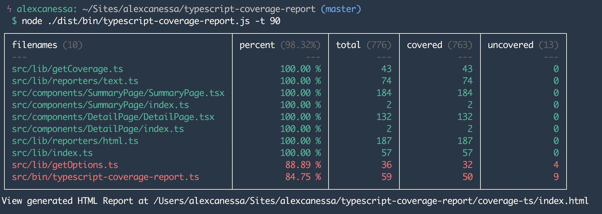
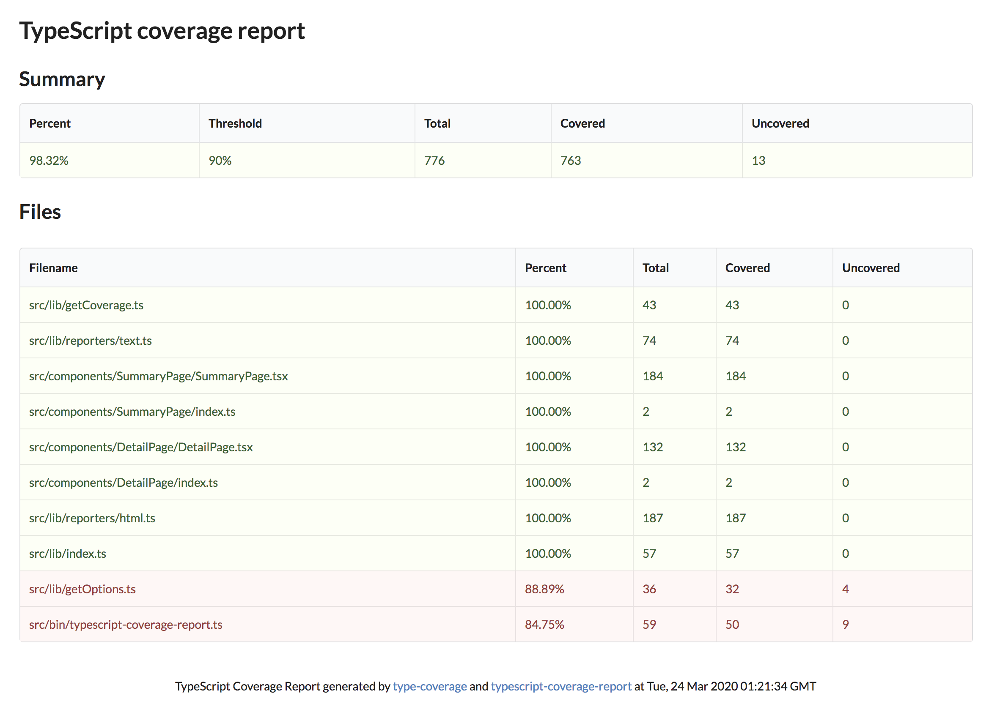
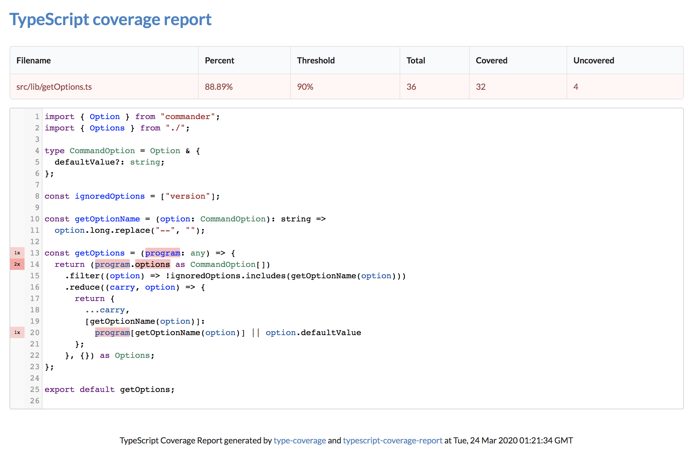

# TypeScript Coverage Report

[](https://badge.fury.io/js/typescript-coverage-report)
[](https://www.npmjs.com/package/typescript-coverage-report)
[](https://github.com/RichardLitt/standard-readme)
[](https://opensource.org/licenses/mit-license.php)

<!-- ALL-CONTRIBUTORS-BADGE:START - Do not remove or modify this section -->

[](#contributors-)
<!-- ALL-CONTRIBUTORS-BADGE:END -->

Node command line tool for generating TypeScript coverage reports ✨

## Overview

This package fills the gap of a missing type coverage reporting tool which is present in the Flow ecosystem, strongly inspired by the amazing work done by [`flow-coverage-report`](https://github.com/rpl/flow-coverage-report) and using data generated by [`type-coverage`](https://github.com/plantain-00/type-coverage).

[See an example of the coverage report](https://alexcanessa.github.io/typescript-coverage-report/).

### Background

To learn more about the reasoning behind this project and its roadmap, please refer to the following article: [**How I built a TS coverage report tool**](https://medium.com/@alexcanessa/how-did-i-build-a-ts-coverage-report-tool-af34e110d02c?sk=de2eb6c78e581aa8d9979629300873b3)

## Install

`typescript-coverage-report` can be installed locally or globally.

Users are advised to install it as a project _(dev)_ dependency and create a script in `package.json`.

```shell
$ yarn add --dev typescript-coverage-report

# OR

$ npm install --save-dev typescript-coverage-report
```

## Usage

If installed locally, add the following to the _scripts_ section of `package.json`.

```json
"scripts": {
  "ts-coverage": "typescript-coverage-report"
}
```

Then run:

```shell
$ yarn ts-coverage

# OR

$ npm run ts-coverage
```

To set the minimum threshold _(80% by default)_, use the `--threshold` option.

```shell
$ yarn ts-coverage --threshold=99
```

As an alternative, options may be provided through the `type-coverage` [configuration](https://github.com/plantain-00/type-coverage#config-in-packagejson), specified in `package.json`.

```json
"typeCoverage": {
  "atLeast": 90
}
```







## Options

The CLI accepts a list of arguments:

| Option                      | Description                                                                   | Default value |
| --------------------------- | ----------------------------------------------------------------------------- | ------------- |
| `-t, --threshold <number>`  | The minimum percentage of coverage required.                                  | 80            |
| `-o, --outputDir <path>`    | The output directory where to generate the report.                            | coverage-ts   |
| `-s, --strict`              | Run the check in strict mode.                                                 | false         |
| `-d, --debug`               | Show debug information.                                                       | false         |
| `-c, --cache`               | Save and reuse type check result from cache.                                  | false         |
| `-p, --project <path>`      | File path to the tsconfig file, eg: `--project "./app/tsconfig.app.json"`     | .             |
| `-i, --ignore-files <glob>` | Ignore files matching a glob. Repeatable: `-i "demo1/*.ts" -i "demo2/foo.ts"` | none          |
| `--ignore-catch`            | Ignore type `any` for (try-)catch clause variables.                           | false         |
| `-u, --ignore-unread`       | Allow writes to variables with implicit any types.                            | false         |
| `-v, --version`             | Print the version.                                                            |               |
| `-h, --help`                | Print the usage information.                                                  |               |

Any trailing arguments are treated as the only files to check, which is useful with tools like `lint-staged`:

```shell
$ typescript-coverage-report src/one.ts src/two.ts
```

## Maintainers

[@alexcanessa](https://github.com/alexcanessa)

## Contributing

Feel free to dive in! [Open an issue](https://github.com/alexcanessa/typescript-coverage-report/issues/new/choose) or submit PRs.

On this project we follow the [Contributor Covenant Code of Conduct](https://www.contributor-covenant.org/version/1/3/0/code-of-conduct/).

### Developing

Thanks for contributing!

This project uses [pnpm](https://pnpm.io) and requires Node 22.12 or newer.

```bash
# Install dependencies (this also installs the git hooks).
$ pnpm install
# Build the TypeScript files and watch for changes.
$ pnpm build --watch
# Link the package globally, so you can test it in other projects.
$ pnpm link --global
```

Before opening a pull request, run the same checks CI will run:

```bash
$ pnpm typecheck && pnpm lint:ci && pnpm test
```

### Commit messages

This project follows the [Angular commit messages](https://github.com/angular/angular/blob/master/CONTRIBUTING.md#commit), but it's very open to emojis 🤯.

### Contributors ✨

Thanks goes to these wonderful people ([emoji key](https://allcontributors.org/docs/en/emoji-key)):

<!-- ALL-CONTRIBUTORS-LIST:START - Do not remove or modify this section -->
<!-- prettier-ignore-start -->
<!-- markdownlint-disable -->
<table>
  <tbody>
    <tr>
      <td align="center" valign="top" width="14.28%"><a href="https://github.com/tsaiDavid"><br /><sub><b>David Tsai</b></sub></a><br /><a href="https://github.com/alexcanessa/typescript-coverage-report/commits?author=tsaiDavid" title="Documentation">📖</a> <a href="https://github.com/alexcanessa/typescript-coverage-report/issues?q=author%3AtsaiDavid" title="Bug reports">🐛</a></td>
      <td align="center" valign="top" width="14.28%"><a href="https://wvvw.me"><br /><sub><b>Alexis Tyler</b></sub></a><br /><a href="https://github.com/alexcanessa/typescript-coverage-report/issues?q=author%3AOmgImAlexis" title="Bug reports">🐛</a></td>
      <td align="center" valign="top" width="14.28%"><a href="https://effectivetypescript.com"><br /><sub><b>Dan Vanderkam</b></sub></a><br /><a href="https://github.com/alexcanessa/typescript-coverage-report/commits?author=danvk" title="Code">💻</a></td>
      <td align="center" valign="top" width="14.28%"><a href="http://dignat.se"><br /><sub><b>Daniel Edholm Ignat</b></sub></a><br /><a href="https://github.com/alexcanessa/typescript-coverage-report/commits?author=dignite" title="Code">💻</a></td>
      <td align="center" valign="top" width="14.28%"><a href="https://kyle.kiwi"><br /><sub><b>Kyℓe Hensel</b></sub></a><br /><a href="https://github.com/alexcanessa/typescript-coverage-report/commits?author=k-yle" title="Code">💻</a></td>
      <td align="center" valign="top" width="14.28%"><a href="https://github.com/cabello"><br /><sub><b>Danilo Cabello</b></sub></a><br /><a href="https://github.com/alexcanessa/typescript-coverage-report/commits?author=cabello" title="Code">💻</a></td>
      <td align="center" valign="top" width="14.28%"><a href="http://sanjaypojo.com"><br /><sub><b>Sanjay Guruprasad</b></sub></a><br /><a href="https://github.com/alexcanessa/typescript-coverage-report/issues?q=author%3Asanjaypojo" title="Bug reports">🐛</a></td>
    </tr>
    <tr>
      <td align="center" valign="top" width="14.28%"><a href="https://stackexchange.com/users/4249831/luislhl?tab=accounts"><br /><sub><b>Luis Helder</b></sub></a><br /><a href="https://github.com/alexcanessa/typescript-coverage-report/issues?q=author%3Aluislhl" title="Bug reports">🐛</a></td>
      <td align="center" valign="top" width="14.28%"><a href="https://github.com/tomardern"><br /><sub><b>Tom Ardern</b></sub></a><br /><a href="https://github.com/alexcanessa/typescript-coverage-report/issues?q=author%3Atomardern" title="Bug reports">🐛</a> <a href="https://github.com/alexcanessa/typescript-coverage-report/commits?author=tomardern" title="Code">💻</a></td>
      <td align="center" valign="top" width="14.28%"><a href="https://github.com/lroskoshin"><br /><sub><b>lroskoshin</b></sub></a><br /><a href="https://github.com/alexcanessa/typescript-coverage-report/commits?author=lroskoshin" title="Code">💻</a></td>
      <td align="center" valign="top" width="14.28%"><a href="https://github.com/MhMadHamster"><br /><sub><b>Max Burmagin</b></sub></a><br /><a href="https://github.com/alexcanessa/typescript-coverage-report/commits?author=MhMadHamster" title="Code">💻</a></td>
      <td align="center" valign="top" width="14.28%"><a href="https://ceramichacker.com"><br /><sub><b>Alexander Skvortsov</b></sub></a><br /><a href="https://github.com/alexcanessa/typescript-coverage-report/commits?author=askvortsov1" title="Code">💻</a></td>
      <td align="center" valign="top" width="14.28%"><a href="https://www.linkedin.com/in/adicuco/"><br /><sub><b>Adi Cucolaș</b></sub></a><br /><a href="https://github.com/alexcanessa/typescript-coverage-report/commits?author=adicuco" title="Code">💻</a></td>
      <td align="center" valign="top" width="14.28%"><a href="https://github.com/StaRenn"><br /><sub><b>Stanislav Golyshev</b></sub></a><br /><a href="https://github.com/alexcanessa/typescript-coverage-report/commits?author=StaRenn" title="Code">💻</a></td>
    </tr>
    <tr>
      <td align="center" valign="top" width="14.28%"><a href="https://github.com/roikoren755"><br /><sub><b>roikoren755</b></sub></a><br /><a href="https://github.com/alexcanessa/typescript-coverage-report/commits?author=roikoren755" title="Code">💻</a></td>
      <td align="center" valign="top" width="14.28%"><a href="https://github.com/jinphic"><br /><sub><b>jinphic</b></sub></a><br /><a href="https://github.com/alexcanessa/typescript-coverage-report/commits?author=jinphic" title="Code">💻</a></td>
      <td align="center" valign="top" width="14.28%"><a href="http://brandonbarker.me"><br /><sub><b>Brandon Barker</b></sub></a><br /><a href="https://github.com/alexcanessa/typescript-coverage-report/commits?author=ProjectBarks" title="Code">💻</a></td>
      <td align="center" valign="top" width="14.28%"><a href="https://stanyslasbres.fr"><br /><sub><b>Stanyslas Bres</b></sub></a><br /><a href="https://github.com/alexcanessa/typescript-coverage-report/commits?author=sybers" title="Code">💻</a></td>
    </tr>
  </tbody>
</table>

<!-- markdownlint-restore -->
<!-- prettier-ignore-end -->

<!-- ALL-CONTRIBUTORS-LIST:END -->

This project follows the [all-contributors](https://github.com/all-contributors/all-contributors) specification. Contributions of any kind welcome!

## Licence

[MIT](https://spdx.org/licenses/MIT.html) @ Alessandro Canessa

[](https://forthebadge.com)
